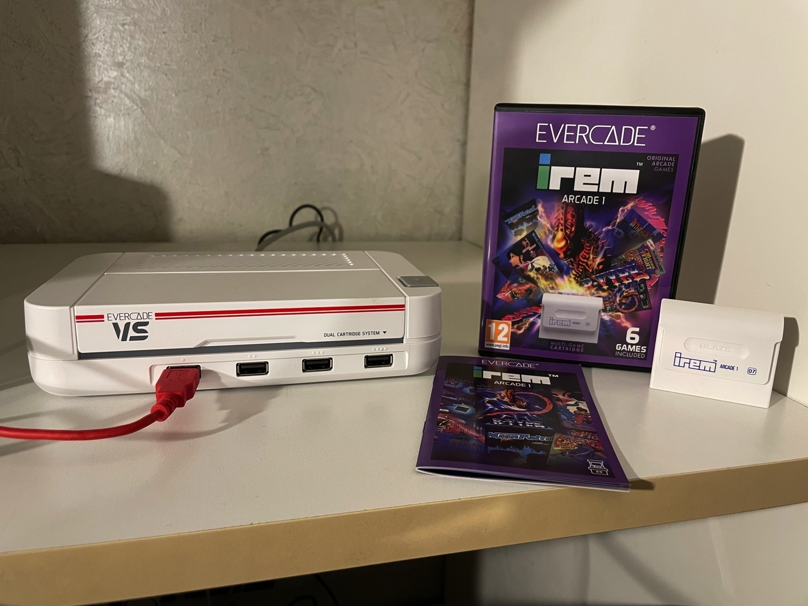

## Introduzione

Devo essere onesto sul mio evercade : inaspettatamente mi sto divertendo. Comprato un anno fa per il design, ho ricominciato a usarlo in questi giorni e sto riscoprendo alcuni videogiochi arcade.

**SI**, ci sono il MAME e FinalBurn...  
**SI**, ci sono siti con le ROM gratis...  

Ma devo dire che alla Blaze sono stati bravi a creare un pacchetto completo, elegante e collezionabile a un prezzo ragionevole (20€). Con la sua bella cartuccia fisica ed il manuale di istruzioni a colori (*chi ti da più un manuale di questi tempi?!*)

## Cosa mi piace

### Il peso della console

E quando parlo di "peso", intendo proprio il peso "fisico". Molte miniconsole recenti pesano appena poche centinaia di grammi. Sembrerà assurdo, ma l'aver aggiunto un piccolo peso all'interno della console la rende più "credibile".

Qui tieni fra le mani la console, ed il suo peso ti fa pensare di avere fra le mani qualcosa di sostanzioso. Lo so, è un preconcetto. Ma nel campo del retrogaming incredibilmente è un fattore che aiuta.

## Cosa non mi piace

Di sicuro non mi piace il fatto che manchino tutti i giochi delle case più blasonate. Al momento di scrivere questa mini-recensione, non abbiamo visto giochi realizzati da giganti come Konami, Sega o NEC. Mentre una selezione di giochi Capcom e Taito è disponibile unicamente su versioni *specializzate* come Evercade EXP, impedendo di fatto la distribuzione su cartuccia.

## Quindi, riassumendo...

Ci sono margini per migliorare, anche se l'attuale situazione caotica non mi lascia particolarmente ottimista.