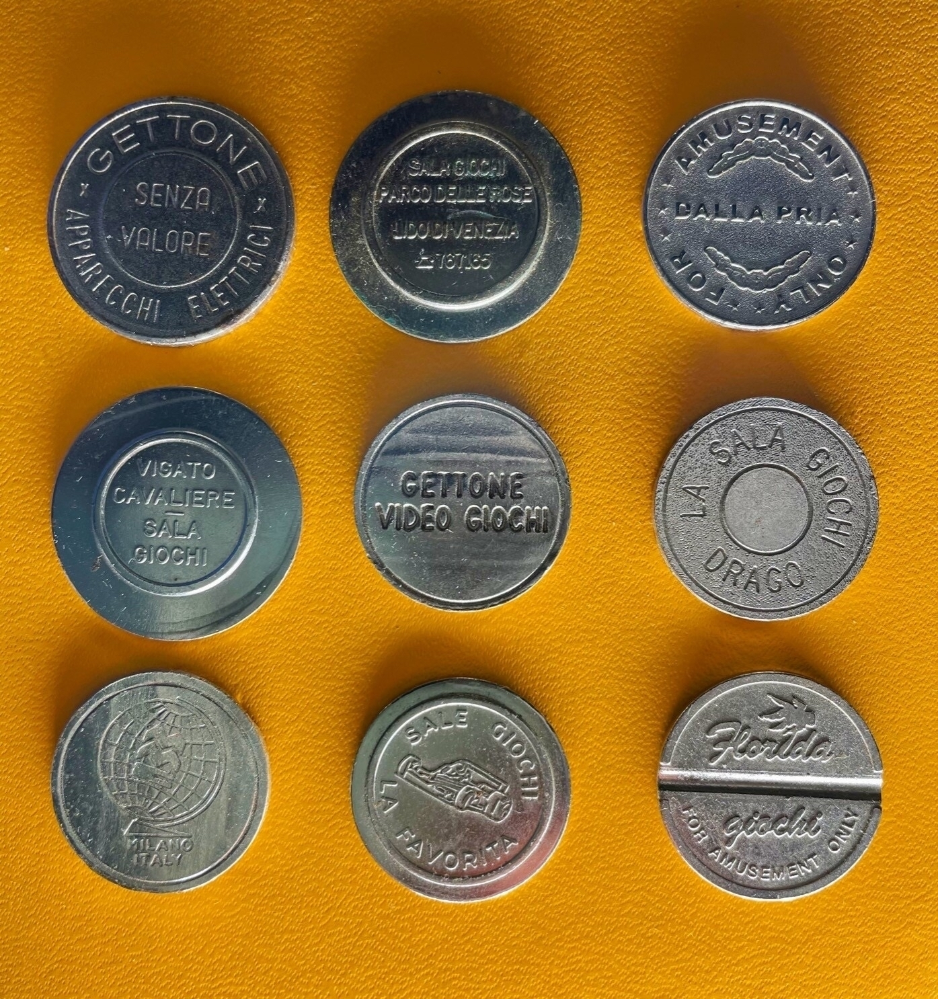

Affascinato dal loro conio, ho sempre conservato qualche gettone delle sale giochi che frequentavo senza spenderli. Ma ho iniziato a raccoglierli sistematicamente solo a partire dall’inizio degli anni Novanta, quando era divenuto chiaro che la maggior parte di esse si sarebbe estinta.

La maggior parte di queste monetine raccontano una propria storia. Quella di un bar o di una sala giochi dove si andava a divertirsi con le sale giochi, e che oggi non esiste più.

Questi gettoni provengono dalla mia piccola collezione personale, raccolta nei bar e nelle sale giochi italiane negli anni Ottanta e Novanta.