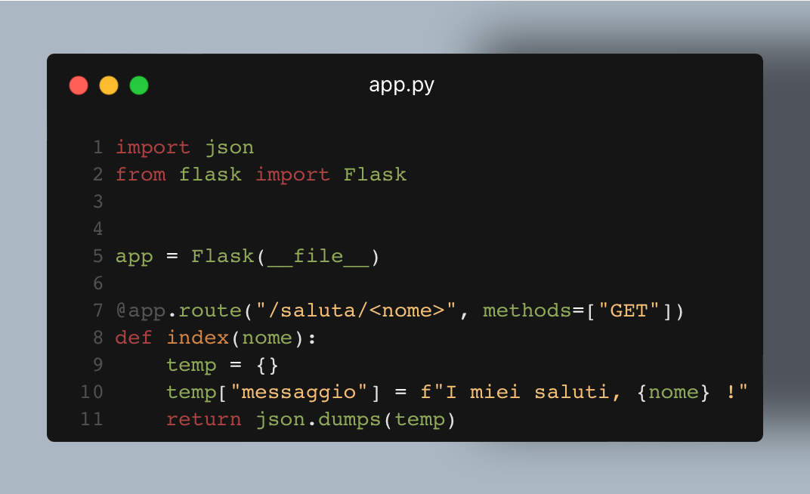

## Questa è una prova

Ciao. Come avrai potuto intuire dal titolo, questa è semplicemente una prova in cui cerco di inserire un articolo con un immagine PNG contenente del testo copiabile.



Nello specifico, questo è il codice sorgente:

```python
import json
from flask import Flask

app = Flask(__file__)

@app.route("/saluta/<nome>", methods=["GET"])
def index(nome):
    temp = {}
    temp["messaggio"] = f"I miei saluti, {nome} !"
    return json.dumps(temp)
```

Ora che l’ho fatto, avrò bisogno di vedere come è possibile esportare il tutto, facendo meno fatica possibile.
Arrivederci.
