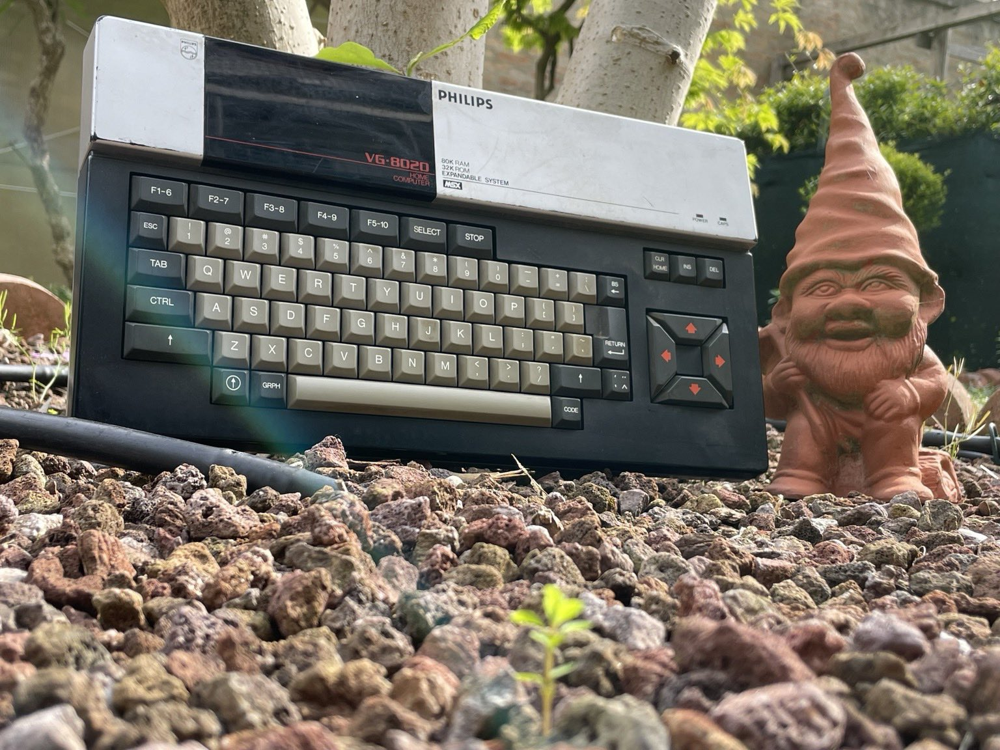

Ho fatto delle prove con ugBASIC 1.13.3 scaricato da <ugbasic.iwashere.eu>, ed in circa dieci minuti e scrivendo meno di 30 line di codice ho creato il più inutile degli salvaschermo per il mio vecchio home computer MSX Philips VG-8020 degli anni ottanta 🤣



Ad ogni modo, questo dimostra quanto possa essere semplice utilizzare questo strumento per creare un nuovo videogioco o una nuova utility, usando un linguaggio di alto livello e compilando in pochi istanti il programma in un comodo file ROM per MSX1.

## Il programma in BASIC

Vabbè, ho allegato qui sotto il listato BASIC in modo che anche voi possiate vedere cosa ho scritto!

```BASIC
init:
    RANDOMIZE 
    tt = "MSX Rocks"
    x = 1
    y = RND(23)+ 1
    color = RND(13) + 2
    dz = 1
    s = ""

mainloop:
    DO
        PEN color
        LOCATE x, y	
        IF dz == 1 THEN
            PRINT SPACE(1);
        ENDIF
        IF s <> tt THEN
            s = tt
        ENDIF
        PRINT s;
        IF dz == -1 THEN
            PRINT SPACE(1);
        ENDIF
        WAIT 150 MILLISECOND
        x = x + dz
        IF dz == 1 THEN
            IF x > 20 THEN
                x = 20
                dz = -dz
            ENDIF
        ENDIF
        IF dz == -1 THEN
            IF x < 1 THEN
                x = 1
                LOCATE x, y
                PRINT SPACE(LEN(tt));
                y = RND(23) + 1
                dz = -dz
            ENDIF
        ENDIF
        color = RND(13) + 2
    LOOP
```

Se vuoi scaricare il programma completo senza dovero trascrivere, clicca su [questo link](salvaschermo.bas.zip)